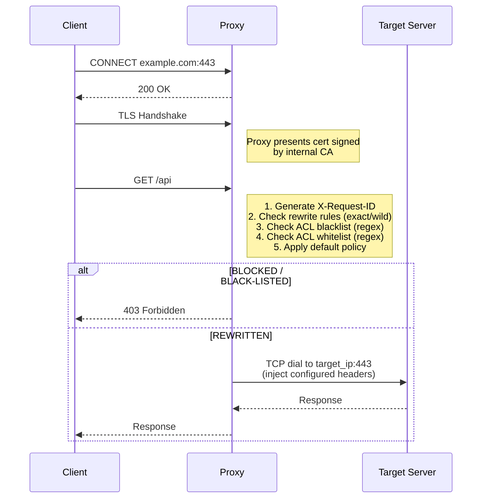
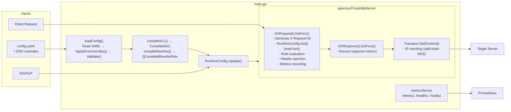
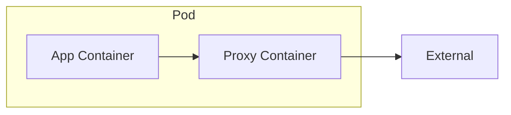
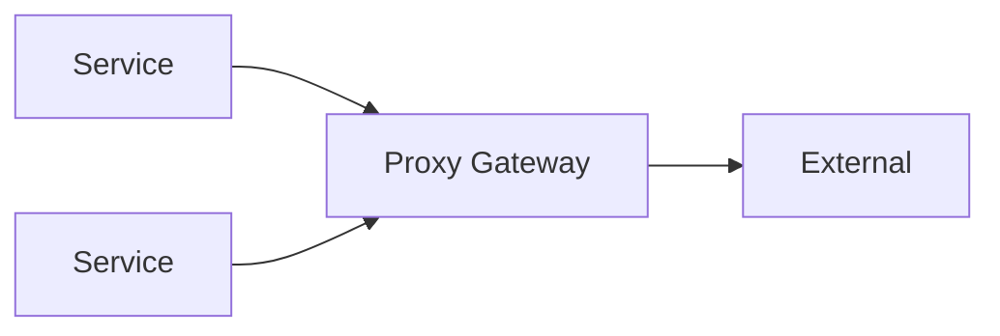

# Architecture

## Overview

go-egress-proxy is a transparent MITM (Man-in-the-Middle) proxy that implements split-brain DNS at the TCP layer. Instead of modifying DNS infrastructure, it intercepts outbound connections and routes them to configured IP addresses based on domain rules.

## Request Flow



## Components

### RuntimeConfig

Thread-safe configuration holder that enables hot-reload without restart:

```go
type RuntimeConfig struct {
    mu           sync.RWMutex
    config       Config
    acl          CompiledACL
    rewrites     []CompiledRewriteRule
    rewriteExact map[string]*CompiledRewriteRule  // O(1) lookup
}
```

- Uses `sync.RWMutex` for concurrent read access
- `Update()` atomically replaces all config
- `Get()` returns current config with read lock

### Configuration Loader

Loads and validates YAML configuration at startup and on SIGHUP:

1. Read YAML file from `CONFIG_PATH` (default: `config.yaml`)
2. Apply environment variable overrides
3. Validate required fields and values
4. Compile patterns (ACL and rewrites) via `wildcardToRegex()`

Environment variable overrides follow 12-factor app principles:
- `PROXY_PORT`, `PROXY_METRICS_PORT`, `PROXY_DEFAULT_POLICY`
- `PROXY_MITM_CERT_PATH`, `PROXY_MITM_KEY_PATH` (PEM cert+key)
- `PROXY_MITM_KEYSTORE_PATH`, `PROXY_MITM_KEYSTORE_PASSWORD` (PKCS#12 alternative)
- `PROXY_OUTGOING_CA_BUNDLE`

### ACL Engine

Pre-compiles patterns at startup for efficient runtime matching. ACL patterns support the same syntax as rewrite rules: exact match, wildcards (`*.example.com`), and raw regex (`~<pattern>`). Evaluation order:

1. **Rewrite rules** - Exact match first (O(1) map lookup), then wildcard patterns
2. **Blacklist** - Blocks request if matched
3. **Whitelist** - Allows request if matched
4. **Default policy** - `ALLOW` or `BLOCK` for unmatched domains

### Domain Pattern Matching

Rewrite rules support wildcards and raw regex for domain matching:

```go
// wildcardToRegex converts patterns:
// "example.com"     -> "^example\.com$"           (exact)
// "*.example.com"   -> "^.+\.example\.com$"       (any subdomain depth)
// "*"               -> ".*"                        (match all)
// "~<regex>"        -> compiled as-is             (raw regex, no escaping/anchoring)
```

### Request Handler

The `handleRequest()` function processes every HTTP request:

1. Generate unique `X-Request-ID` for tracing
2. Evaluate against rules (rewrite → blacklist → whitelist → default)
3. Log access with structured JSON (includes request ID)
4. Record Prometheus metrics with bounded cardinality
5. Inject configured headers for rewritten requests
6. Return 403 for blocked requests

### Magic Dialer

The custom `DialContext` in `http.Transport` is where split-brain DNS happens:

```go
DialContext: func(ctx context.Context, network, addr string) (net.Conn, error) {
    host, port, _ := net.SplitHostPort(addr)

    // Fast path: exact match
    if rw, ok := rewriteExact[host]; ok {
        addr = net.JoinHostPort(rw.TargetIP, port)
    } else {
        // Slow path: pattern match
        for _, rw := range rewrites {
            if rw.Pattern.MatchString(host) {
                addr = net.JoinHostPort(rw.TargetIP, port)
                break
            }
        }
    }

    return dialer.DialContext(ctx, network, addr)
}
```

This intercepts the TCP dial and substitutes the IP address while preserving the original hostname for TLS SNI verification.

### Metrics System

Prometheus metrics with bounded cardinality:

| Metric | Type | Labels | Description |
|--------|------|--------|-------------|
| `proxy_traffic_total` | Counter | domain, action | Requests by domain/action |
| `proxy_request_duration_seconds` | Histogram | action | Request latency |
| `proxy_active_connections` | Gauge | - | Current connections |
| `proxy_config_load_errors_total` | Counter | - | Config load failures |
| `proxy_config_reloads_total` | Counter | - | Successful reloads |
| `proxy_upstream_errors_total` | Counter | type | Upstream errors |
| `proxy_response_status_total` | Counter | class | Response codes |
| `proxy_bytes_total` | Counter | direction | Bytes transferred |

Domain normalization prevents cardinality explosion:
- Known rewrite domains: tracked individually
- ACL-matched domains: tracked by base domain (TLD+1)
- Unknown domains: grouped as `_other`

### Health Server

Separate HTTP server on metrics port exposing:
- `/metrics` - Prometheus metrics
- `/healthz` - Liveness probe (process is running)
- `/readyz` - Readiness probe (ready for traffic)

### Signal Handling

| Signal | Action |
|--------|--------|
| `SIGINT` / `SIGTERM` | Graceful shutdown with 30s drain |
| `SIGHUP` | Hot reload configuration |

## Data Flow



## Security Considerations

### TLS

- Internal CA certificate must be trusted by all clients
- Outbound connections enforce TLS 1.2 minimum
- System CA pool used for upstream verification (plus optional custom bundle)

### Attack Surface

- Proxy terminates TLS, has access to plaintext traffic
- Deploy in trusted network segment (sidecar pattern recommended)
- Metrics cardinality bounded to prevent OOM attacks
- Request IDs are cryptographically random (8 bytes)

### Configuration Security

- Certificate paths validated at startup
- Invalid regex patterns cause startup failure (fail-fast)
- Environment overrides allow secrets management integration

## Deployment Patterns

### Sidecar (Recommended)

Deploy alongside each application pod:


Application sets `HTTPS_PROXY=http://localhost:8080`.

### Gateway

Central proxy for multiple services:


Requires network policies to enforce traffic flow.

## Limitations

- **No client-facing HTTP/2**: Clients connect via HTTP/1.1 through the MITM layer; outbound connections support HTTP/2
- **No WebSocket inspection**: Passes through after CONNECT
- **Single CA**: All MITM certificates signed by one CA
- **No request body inspection**: Header-level filtering only

