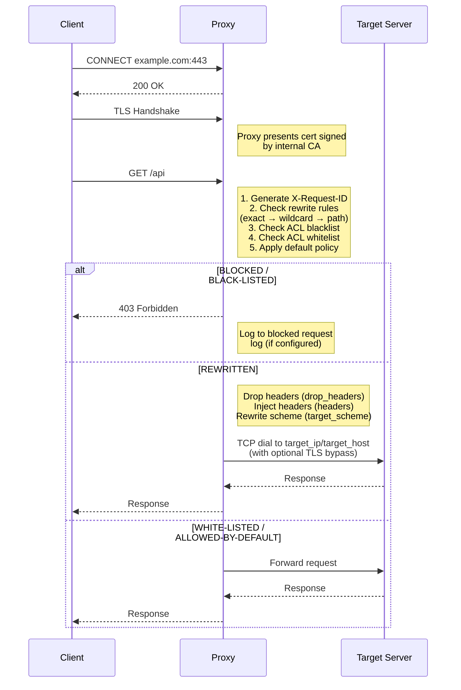
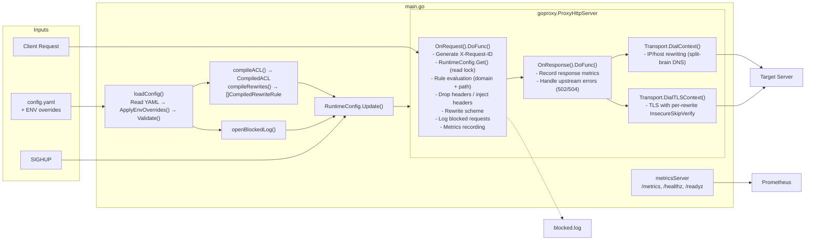
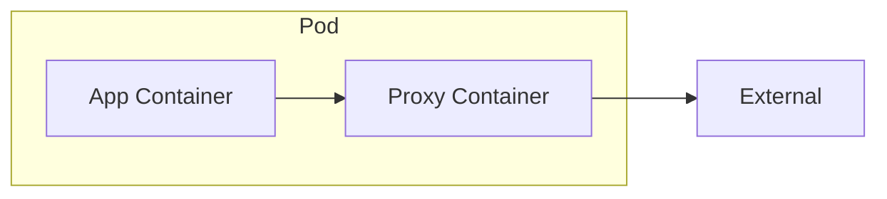
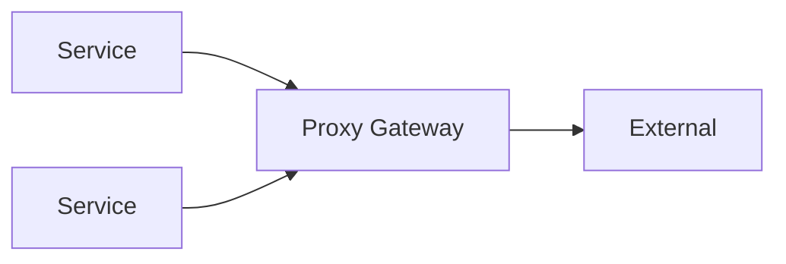

# Architecture

## Overview

go-egress-proxy is a transparent MITM (Man-in-the-Middle) proxy that implements split-brain DNS at the TCP layer. Instead of modifying DNS infrastructure, it intercepts outbound connections and routes them to configured IP addresses or hostnames based on domain and path rules.

## Request Flow



## Response Status Codes

| Code | Meaning | When |
|------|---------|------|
| 200 | OK | Request succeeded through to upstream |
| 403 | Forbidden | Request blocked by ACL (blacklisted or default BLOCK policy) |
| 502 | Bad Gateway | Upstream unreachable: DNS lookup failed, connection refused, or connection reset |
| 504 | Gateway Timeout | Upstream accepted the connection but did not respond in time |

The proxy distinguishes timeout errors (`net.Error.Timeout()`, `context.DeadlineExceeded`) from all other upstream failures. This applies to both plain HTTP requests (via the `OnResponse` handler) and CONNECT-level failures (via `ConnectionErrHandler`).

## Components

### RuntimeConfig

Thread-safe configuration holder that enables hot-reload without restart:

```go
type RuntimeConfig struct {
    mu            sync.RWMutex
    config        Config
    acl           CompiledACL
    rewrites      []CompiledRewriteRule
    rewriteExact  map[string]*CompiledRewriteRule  // O(1) lookup
    blockedLogger *slog.Logger                     // nil when disabled
    blockedFile   *os.File                         // underlying file for Close()
}
```

- Uses `sync.RWMutex` for concurrent read access
- `Update()` atomically replaces all config; excludes domains with `path_pattern` rules from the exact map so they are evaluated sequentially (preserving YAML order)
- `Get()` returns current config with read lock
- `GetBlockedLogger()` returns the blocked request logger (nil when disabled)
- `CloseBlockedLog()` closes the log file handle on shutdown

### Configuration Loader

Loads and validates YAML configuration at startup and on SIGHUP:

1. Read YAML file from `CONFIG_PATH` (default: `config.yaml`)
2. Apply environment variable overrides
3. Validate required fields and values
4. Compile patterns (ACL and rewrites) via `wildcardToRegex()`

Environment variable overrides follow 12-factor app principles:
- `PROXY_PORT`, `PROXY_METRICS_PORT`, `PROXY_DEFAULT_POLICY`
- `PROXY_MITM_CERT_PATH`, `PROXY_MITM_KEY_PATH` (PEM cert+key)
- `PROXY_MITM_KEYSTORE_PATH`, `PROXY_MITM_KEYSTORE_PASSWORD` (PKCS#12 alternative)
- `PROXY_OUTGOING_CA_BUNDLE`, `PROXY_OUTGOING_TRUSTSTORE_PATH`, `PROXY_OUTGOING_TRUSTSTORE_PASSWORD`
- `PROXY_INSECURE_SKIP_VERIFY`, `PROXY_BLOCKED_LOG_PATH`

### ACL Engine

Pre-compiles patterns at startup for efficient runtime matching. ACL patterns support the same syntax as rewrite rules: exact match, wildcards (`*.example.com`), and raw regex (`~<pattern>`). Evaluation order:

1. **Rewrite rules** - Exact match first (O(1) map lookup), then wildcard/regex patterns with optional `path_pattern` filtering
2. **Blacklist** - Blocks request if matched
3. **Whitelist** - Allows request if matched
4. **Default policy** - `ALLOW` or `BLOCK` for unmatched domains

### Domain Pattern Matching

Rewrite rules support wildcards and raw regex for domain matching:

```go
// wildcardToRegex converts patterns:
// "example.com"     -> "^example\.com$"           (exact)
// "*.example.com"   -> "^.+\.example\.com$"       (any subdomain depth)
// "*"               -> ".*"                        (match all)
// "~<regex>"        -> compiled as-is             (raw regex, no escaping/anchoring)
```

### Request Handler

The `handleRequest()` function processes every HTTP request:

1. Generate unique `X-Request-ID` for tracing
2. Evaluate against rules (rewrite → blacklist → whitelist → default)
   - Rewrite matching: exact map lookup, then sequential pattern + path matching
   - Path-based rules use `path_pattern` regex against `r.URL.Path` (first match wins)
3. Store matched rewrite in request context (for dialer access)
4. Log access with structured JSON (includes request ID)
5. Record Prometheus metrics with bounded cardinality
6. Log blocked requests to JSON file (if `blocked_log_path` is configured)
7. Return 403 for blocked requests (`BLACK-LISTED` or `BLOCKED`)
8. For rewritten requests:
   - Drop headers listed in `drop_headers`
   - Inject headers from `headers` map
   - Rewrite `r.URL.Scheme` if `target_scheme` is set

### Dialers (Split-Brain DNS)

Two custom dial functions in `http.Transport` implement split-brain DNS:

**`makeDialer()` (plain TCP)**

For HTTP upstream connections. Checks request context first (for path-based rewrites set by `handleRequest`), then falls back to `lookupRewrite()` for domain-only rules.

```go
DialContext: func(ctx context.Context, network, addr string) (net.Conn, error) {
    host, port, _ := net.SplitHostPort(addr)

    // Check context first (path-based rewrites)
    rw, ok := ctx.Value(rewriteCtxKey).(rewriteResult)
    if !ok {
        rw = lookupRewrite(host, rewrites, rewriteExact)
    }

    if rw.targetIP != "" {
        addr = net.JoinHostPort(rw.targetIP, port)
    } else if rw.targetHost != "" {
        addr = net.JoinHostPort(rw.targetHost, port)
    }

    return dialer.DialContext(ctx, network, addr)
}
```

**`makeTLSDialer()` (TLS)**

For HTTPS upstream connections. Performs TCP dial with IP/host substitution, then a separate TLS handshake with per-connection configuration:

- SNI set to the original hostname (preserving TLS verification)
- `InsecureSkipVerify` enabled if global `insecure_skip_verify` is set or per-rewrite `insecure` flag is true
- Custom `RootCAs` pool combining system CAs, optional PEM CA bundle, and optional PKCS#12 truststore

Both dialers support `target_ip` (direct IP routing) and `target_host` (DNS-resolved hostname routing).

### Blocked Request Log

Optional JSON log file for auditing blocked requests:

- Configured via `blocked_log_path` (YAML) or `PROXY_BLOCKED_LOG_PATH` (env)
- Only logs requests with action `BLACK-LISTED` or `BLOCKED`
- Each entry: `request_id`, `client`, `host`, `method`, `path`, `action`
- File created with 0600 permissions
- Reopened on SIGHUP for log rotation support
- Old file handle closed after successful reload

### Metrics System

Prometheus metrics with bounded cardinality:

| Metric | Type | Labels | Description |
|--------|------|--------|-------------|
| `proxy_traffic_total` | Counter | domain, action | Requests by domain/action |
| `proxy_request_duration_seconds` | Histogram | action | Request latency |
| `proxy_active_connections` | Gauge | - | Current connections |
| `proxy_config_load_errors_total` | Counter | - | Config load failures |
| `proxy_config_reloads_total` | Counter | - | Successful reloads |
| `proxy_upstream_errors_total` | Counter | type | Upstream errors |
| `proxy_response_status_total` | Counter | class | Response codes |
| `proxy_bytes_total` | Counter | direction | Bytes transferred |

Domain normalization prevents cardinality explosion:
- Known rewrite domains: tracked individually
- ACL-matched domains: tracked by base domain (TLD+1)
- Unknown domains: grouped as `_other`

### Health Server

Separate HTTP server on metrics port exposing:
- `/metrics` - Prometheus metrics
- `/healthz` - Liveness probe (process is running)
- `/readyz` - Readiness probe (ready for traffic)

### Signal Handling

| Signal | Action |
|--------|--------|
| `SIGINT` / `SIGTERM` | Graceful shutdown with 30s drain |
| `SIGHUP` | Hot reload configuration + reopen blocked log file |

## Data Flow



## Security Considerations

### TLS

- Internal CA certificate must be trusted by all clients
- Outbound connections enforce TLS 1.2 minimum with ALPN (`h2`, `http/1.1`)
- System CA pool used for upstream verification, plus optional PEM CA bundle and/or PKCS#12 truststore (additive)
- Global `insecure_skip_verify` disables all upstream TLS verification (dev/test only)
- Per-rewrite `insecure` flag skips verification for specific internal targets (e.g., self-signed services)

### Attack Surface

- Proxy terminates TLS, has access to plaintext traffic
- Deploy in trusted network segment (sidecar pattern recommended)
- Metrics cardinality bounded to prevent OOM attacks
- Request IDs are cryptographically random (8 bytes)
- Blocked request log file created with 0600 permissions

### Configuration Security

- Certificate paths validated at startup and on `validate` subcommand
- Invalid regex patterns cause startup failure (fail-fast)
- `target_ip`/`target_host` and `target_scheme` validated at load time
- Environment overrides allow secrets management integration

## Deployment Patterns

### Sidecar (Recommended)

Deploy alongside each application pod:


Application sets `HTTPS_PROXY=http://localhost:8080`.

### Gateway

Central proxy for multiple services:


Requires network policies to enforce traffic flow.

## Limitations

- **No client-facing HTTP/2**: Clients connect via HTTP/1.1 through the MITM layer; outbound connections support HTTP/2
- **No WebSocket inspection**: Passes through after CONNECT
- **Single CA**: All MITM certificates signed by one CA
- **No request body inspection**: Header-level filtering only
