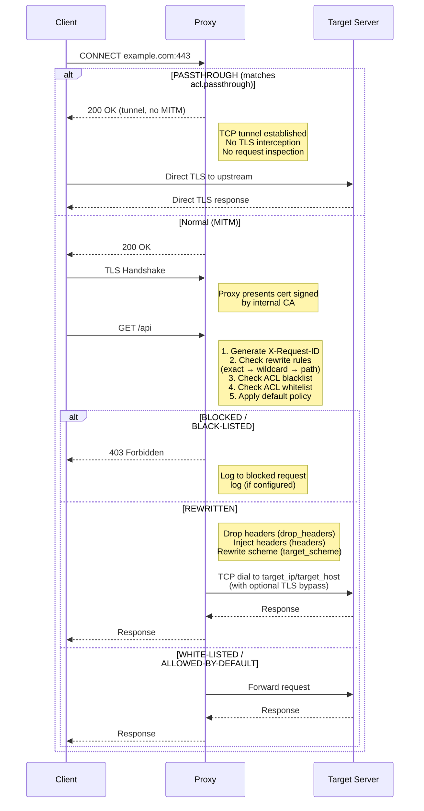
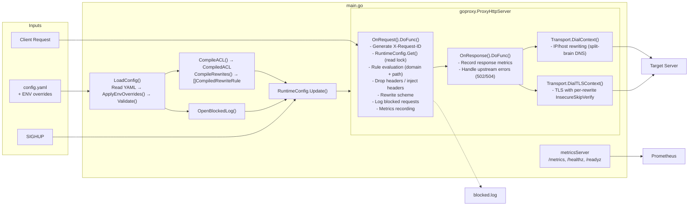
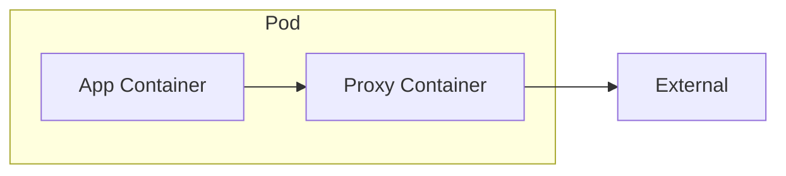
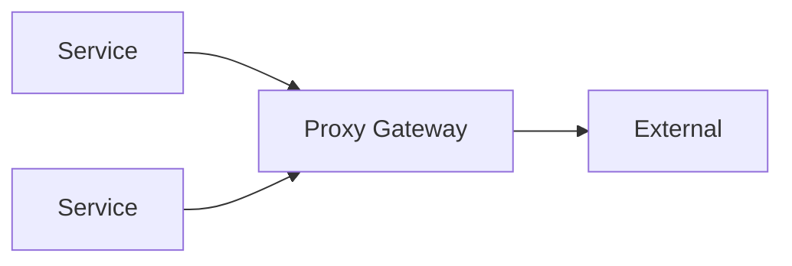

# Architecture

## Overview

go-egress-proxy is a transparent MITM (Man-in-the-Middle) proxy that implements split-brain DNS at the TCP layer. Instead of modifying DNS infrastructure, it intercepts outbound connections and routes them to configured IP addresses or hostnames based on domain and path rules.

## Request Flow


```mermaid
sequenceDiagram
    participant Client
    participant Proxy
    participant Target as Target Server

    Client->>Proxy: CONNECT example.com:443

    alt PASSTHROUGH (matches acl.passthrough)
        Proxy-->>Client: 200 OK (tunnel, no MITM)
        Note right of Proxy: TCP tunnel established<br/>No TLS interception<br/>No request inspection
        Client->>Target: Direct TLS to upstream
        Target-->>Client: Direct TLS response
    else Normal (MITM)
        Proxy-->>Client: 200 OK

        Client->>Proxy: TLS Handshake
        Note right of Proxy: Proxy presents cert signed<br/>by internal CA

        Client->>Proxy: GET /api
        Note right of Proxy: 1. Generate X-Request-ID<br/>2. Check rewrite rules<br/>   (exact → wildcard → path)<br/>3. Check ACL blacklist<br/>4. Check ACL whitelist<br/>5. Apply default policy

    alt BLOCKED / BLACK-LISTED
        Proxy-->>Client: 403 Forbidden
        Note right of Proxy: Log to blocked request<br/>log (if configured)
    else REWRITTEN
        Note right of Proxy: Drop headers (drop_headers)<br/>Inject headers (headers)<br/>Rewrite scheme (target_scheme)
        Proxy->>Target: TCP dial to target_ip/target_host<br/>(with optional TLS bypass)
        Target-->>Proxy: Response
        Proxy-->>Client: Response
    else WHITE-LISTED / ALLOWED-BY-DEFAULT
        Proxy->>Target: Forward request
        Target-->>Proxy: Response
        Proxy-->>Client: Response
    end
    end
```

## Response Status Codes

| Code | Meaning | When |
|------|---------|------|
| 200 | OK | Request succeeded through to upstream |
| 403 | Forbidden | Request blocked by ACL (blacklisted or default BLOCK policy) |
| 502 | Bad Gateway | Upstream unreachable: DNS lookup failed, connection refused, or connection reset |
| 504 | Gateway Timeout | Upstream accepted the connection but did not respond in time |

The proxy distinguishes timeout errors (`net.Error.Timeout()`, `context.DeadlineExceeded`) from all other upstream failures. This applies to both plain HTTP requests (via the `OnResponse` handler) and CONNECT-level failures (via `ConnectionErrHandler`).

## Components

### RuntimeConfig

Thread-safe configuration holder that enables hot-reload without restart:

```go
type RuntimeConfig struct {
    mu            sync.RWMutex
    config        Config
    acl           CompiledACL
    rewrites      []CompiledRewriteRule
    rewriteExact  map[string]*CompiledRewriteRule  // O(1) lookup, normalized keys
    tlsConfig     *tls.Config                      // outbound TLS (rebuilt on reload)
    blockedLogger *slog.Logger                     // nil when disabled
    blockedFile   *os.File                         // underlying file for Close()
    trace         CompiledTrace                    // compiled trace rules
    traceLogger   *slog.Logger                     // nil when trace log undirected
    traceFile     *os.File                         // underlying trace file for Close()
}
```

- Uses `sync.RWMutex` for concurrent read access
- `Update()` atomically replaces all config; excludes domains with `path_pattern` rules from the exact map so they are evaluated sequentially (preserving YAML order)
- `Get()` returns current config with read lock
- `GetBlockedLogger()` returns the blocked request logger (nil when disabled)
- `CloseBlockedLog()` closes the log file handle on shutdown

### Certificate Generator (`gencert`)

Built-in CLI subcommand for generating root and intermediate CA certificates:

- Supports RSA (2048/4096), ECDSA (P-256/P-384), and Ed25519 key algorithms
- Root CA: self-signed with configurable subject and validity
- Intermediate CA: signed by a parent CA, with `MaxPathLen` control
- Output formats: PEM cert+key, PEM chain, PKCS#12 keystore (cert+key)
- Client trust bundles: PEM trust bundle, PKCS#12 truststore (for Java keystore import)
- `generateKeyPair()` creates keys by algorithm name
- `RunGencert()` orchestrates flag parsing, key generation, cert creation, and file output

### Configuration Loader

Loads and validates YAML configuration at startup and on SIGHUP:

1. Read YAML file from `CONFIG_PATH` (default: `config.yaml`)
2. Apply environment variable overrides
3. Validate required fields and values
4. Compile patterns (ACL and rewrites) via `WildcardToRegex()`; patterns are
   lowercased and anchored, and every host is normalized with
   `config.NormalizeHost()` (lowercase, trailing dot stripped) before matching,
   so `EVIL.example.com` and `evil.example.com.` cannot slip past a blacklist

Environment variable overrides follow 12-factor app principles:
- `PROXY_PORT`, `PROXY_METRICS_PORT`, `PROXY_DEFAULT_POLICY`
- `PROXY_MITM_CERT_PATH`, `PROXY_MITM_KEY_PATH` (PEM cert+key)
- `PROXY_MITM_KEYSTORE_PATH`, `PROXY_MITM_KEYSTORE_PASSWORD` (PKCS#12 alternative)
- `PROXY_OUTGOING_CA_BUNDLE`, `PROXY_OUTGOING_TRUSTSTORE_PATH`, `PROXY_OUTGOING_TRUSTSTORE_PASSWORD`
- `PROXY_INSECURE_SKIP_VERIFY`, `PROXY_BLOCKED_LOG_PATH`

### ACL Engine

Pre-compiles patterns at startup for efficient runtime matching. ACL patterns support the same syntax as rewrite rules: exact match, wildcards (`*.example.com`), and raw regex (`~<pattern>`). Evaluation order:

**At the CONNECT stage** (before TLS), `proxy.DecideConnect` chooses how the
tunnel is handled:

0a. **Passthrough + blacklist** - Rejected outright. A passthrough tunnel is
    never inspected, so a passthrough pattern overlapping a blacklist entry
    would otherwise hand out an uninspected tunnel to a denied host. This is the
    only case refused at CONNECT time.
0b. **Passthrough** - Tunneled without MITM interception. No request inspection
    occurs, so later ACL stages never see it.
0c. **Everything else** - Intercepted, including blacklisted hosts. Nothing is
    forwarded upstream until the request stages below have run, so a blacklisted
    host is still blocked — but the client receives a readable 403 rather than a
    rejected CONNECT, which most clients surface as an opaque transport error.

**Per request** (plain HTTP, and every intercepted HTTPS request):

1. **Rewrite rules** - Exact match first (O(1) map lookup), then wildcard/regex patterns with optional `path_pattern` filtering
2. **Blacklist** - Blocks request if matched
3. **Whitelist** - Allows request if matched
4. **Default policy** - `ALLOW` or `BLOCK` for unmatched domains

Hostnames are normalized with `config.NormalizeHost` (lowercased, trailing dot
stripped) before every one of these comparisons.

### Domain Pattern Matching

Rewrite rules support wildcards and raw regex for domain matching:

```go
// WildcardToRegex converts patterns:
// "example.com"     -> "^example\.com$"           (exact)
// "*.example.com"   -> "^.+\.example\.com$"       (any subdomain depth)
// "*"               -> ".*"                        (match all)
// "~<regex>"        -> compiled as-is             (raw regex, no escaping/anchoring)
```

### Request Handler

The `HandleRequest()` function processes every HTTP request:

1. Generate unique `X-Request-ID` for tracing
2. Evaluate against rules (rewrite → blacklist → whitelist → default)
   - Rewrite matching: exact map lookup, then sequential pattern + path matching
   - Path-based rules use `path_pattern` regex against `r.URL.Path` (first match wins)
3. Store matched rewrite in request context (for dialer access)
4. Log access with structured JSON (includes request ID)
5. Record Prometheus metrics with bounded cardinality
6. Log blocked requests to JSON file (if `blocked_log_path` is configured)
7. Return 403 for blocked requests (`BLACK-LISTED` or `BLOCKED`)
8. For rewritten requests:
   - Drop headers listed in `drop_headers`
   - Inject headers from `headers` map
   - Rewrite `r.URL.Scheme` if `target_scheme` is set

### Dialers (Split-Brain DNS)

Split-brain DNS is implemented by two custom dial functions, and each request is
routed to a transport dedicated to its upstream identity.

`http.Transport` keys its idle-connection pool on the request URL's scheme and
`host:port`, both fixed *before* the dial functions run. Because the dialers
substitute the target address inside the dial, rules for one domain differing
only by `target_ip`, `target_host` or `insecure` would share a pool key and reuse
each other's connections — misrouting traffic, and handing a connection
negotiated with `InsecureSkipVerify` to a request that required verification.
`proxy.TransportPool` therefore hands out one `*http.Transport` per
`(target_ip | target_host | insecure)` identity, selected per request via
goproxy's `ctx.RoundTripper`. Within one transport, every connection under a
given key really is interchangeable, so Go's pooling and HTTP/2 stay intact.

`TransportPool.Reset()` is called on SIGHUP: the map swap makes stale transports
unreachable, and closing their idle connections releases sockets immediately
rather than at `IdleConnTimeout`.

The dial functions themselves:

**`MakeDialer()` (plain TCP)**

For HTTP upstream connections. Checks request context first (for path-based rewrites set by `HandleRequest`), then falls back to `LookupRewrite()` for domain-only rules.

```go
DialContext: func(ctx context.Context, network, addr string) (net.Conn, error) {
    host, port, _ := net.SplitHostPort(addr)

    // Check context first (path-based rewrites)
    rw, ok := ctx.Value(config.RewriteCtxKey).(proxy.RewriteResult)
    if !ok {
        rw = proxy.LookupRewrite(host, rewrites, rewriteExact)
    }

    if rw.TargetIP != "" {
        addr = net.JoinHostPort(rw.TargetIP, port)
    } else if rw.TargetHost != "" {
        addr = net.JoinHostPort(rw.TargetHost, port)
    }

    return dialer.DialContext(ctx, network, addr)
}
```

**`MakeTLSDialer()` (TLS)**

For HTTPS upstream connections. Performs TCP dial with IP/host substitution, then a separate TLS handshake with per-connection configuration:

- SNI set to the original hostname (preserving TLS verification)
- `InsecureSkipVerify` enabled if global `insecure_skip_verify` is set or per-rewrite `insecure` flag is true
- Custom `RootCAs` pool combining system CAs, optional PEM CA bundle, and optional PKCS#12 truststore

Both dialers support `target_ip` (direct IP routing) and `target_host` (DNS-resolved hostname routing).

### Blocked Request Log

Optional JSON log file for auditing blocked requests:

- Configured via `blocked_log_path` (YAML) or `PROXY_BLOCKED_LOG_PATH` (env)
- Only logs requests with action `BLACK-LISTED` or `BLOCKED`
- Each entry: `request_id`, `client`, `host`, `method`, `path`, `action`
- File created with 0600 permissions
- Reopened on SIGHUP for log rotation support
- Old file handle closed after successful reload

### Request Tracing (`internal/trace`)

Opt-in, full-detail tracing of a subset of requests (configured via the `trace:` block), emitted as one aggregated JSON record per request/tunnel:

- A `*trace.Record` is created in `HandleRequest` when a request matches a trace rule, before any header mutation (so the inbound snapshot is what the client sent)
- The record is threaded to the dialers via the request context (`trace.CtxKey`) — which populate the connected IP, dial timing, and TLS version/cipher — and to the response handler via goproxy `ctx.UserData`
- The record is emitted exactly once (`sync.Once`). **When** depends on body capture:
  - **Capture off (the default):** emitted at header time. The record is
    byte-identical either way — no field is populated after the response headers
    — but a failure occurring *mid-body* is therefore not reflected in it. Enable
    body capture for the rule if that matters.
  - **Capture on:** the response body is wrapped, and the record is emitted when
    that body finishes streaming.

  The body is deliberately left untouched with capture off. goproxy treats a
  changed `resp.Body` as a modified response and re-frames it as chunked, so
  wrapping unconditionally would make an observability switch alter the bytes the
  client receives. `http.NoBody` (204/304) and `101 Switching Protocols` are
  never wrapped for the same reason — a wrapped 101 also fails goproxy's
  `io.ReadWriter` assertion and drops the WebSocket tunnel.
- Blocked (403) and upstream-error (502/504) paths emit via their synthetic responses
- Passthrough (non-MITM) hosts are traced TCP-only via goproxy's per-request `ctx.Dialer` (connected IP, dial timing, bytes up/down)
- Redaction is secure-by-default (`Authorization`, `Proxy-Authorization`, `Cookie`, `Set-Cookie` always masked; `redact_headers`/`redact_query` extend; `log_secrets` disables)
- Independent of the `-v/-vv/-vvv` level; trace log file reopened on SIGHUP for rotation

### Metrics System

Prometheus metrics with bounded cardinality:

| Metric | Type | Labels | Description |
|--------|------|--------|-------------|
| `proxy_traffic_total` | Counter | domain, action | Requests by domain/action |
| `proxy_request_duration_seconds` | Histogram | action | Request latency |
| `proxy_active_connections` | Gauge | - | Current connections |
| `proxy_config_load_errors_total` | Counter | - | Config load failures |
| `proxy_config_reloads_total` | Counter | - | Successful reloads |
| `proxy_upstream_errors_total` | Counter | type | Upstream errors |
| `proxy_response_status_total` | Counter | class | Response codes |
| `proxy_bytes_total` | Counter | direction | Bytes transferred |
| `proxy_trace_records_total` | Counter | mode | Emitted trace records (mitm/passthrough) |

Domain normalization prevents cardinality explosion:
- Known rewrite domains: tracked individually
- ACL-matched domains (whitelist, blacklist, passthrough): tracked by base domain (TLD+1)
- Unknown domains: grouped as `_other`

### Health Server

Separate HTTP server on metrics port exposing:
- `/metrics` - Prometheus metrics
- `/healthz` - Liveness probe (process is running)
- `/readyz` - Readiness probe (ready for traffic)

### Signal Handling

| Signal | Action |
|--------|--------|
| `SIGINT` / `SIGTERM` | Graceful shutdown with 30s drain |
| `SIGHUP` | Hot reload configuration, reopen blocked and trace log files, rebuild outbound TLS, and `TransportPool.Reset()`. Warns about changed `mitm_*` and port settings, which need a restart. |

## Data Flow


```mermaid
flowchart LR
    subgraph Inputs
        config["config.yaml<br/>+ ENV overrides"]
        sighup["SIGHUP"]
        client["Client Request"]
    end

    subgraph main.go
        load["LoadConfig()<br/>Read YAML → ApplyEnvOverrides() → Validate()"]
        compile["CompileACL() → CompiledACL<br/>CompileRewrites() → []CompiledRewriteRule"]
        bllog["OpenBlockedLog()"]
        rtcfg["RuntimeConfig.Update()"]

        subgraph proxy ["goproxy.ProxyHttpServer"]
            onreq["OnRequest().DoFunc()<br/>- Generate X-Request-ID<br/>- RuntimeConfig.Get() (read lock)<br/>- Rule evaluation (domain + path)<br/>- Drop headers / inject headers<br/>- Rewrite scheme<br/>- Log blocked requests<br/>- Metrics recording"]
            onresp["OnResponse().DoFunc()<br/>- Record response metrics<br/>- Handle upstream errors (502/504)"]
            dial["Transport.DialContext()<br/>- IP/host rewriting (split-brain DNS)"]
            tlsdial["Transport.DialTLSContext()<br/>- TLS with per-rewrite InsecureSkipVerify"]
        end

        metrics["metricsServer<br/>/metrics, /healthz, /readyz"]
    end

    target["Target Server"]
    prom["Prometheus"]
    blockedlog["blocked.log"]

    config --> load --> compile --> rtcfg
    load --> bllog --> rtcfg
    sighup --> rtcfg
    rtcfg --> proxy
    client --> onreq --> onresp --> dial --> target
    onresp --> tlsdial --> target
    onreq -.-> blockedlog
    metrics --> prom
```

## Security Considerations

### TLS

- Internal CA certificate must be trusted by all clients
- Outbound connections enforce TLS 1.2 minimum with ALPN (`h2`, `http/1.1`)
- System CA pool used for upstream verification, plus optional PEM CA bundle and/or PKCS#12 truststore (additive)
- Global `insecure_skip_verify` disables all upstream TLS verification (dev/test only)
- Per-rewrite `insecure` flag skips verification for specific internal targets (e.g., self-signed services)

### Attack Surface

- Proxy terminates TLS, has access to plaintext traffic
- Deploy in trusted network segment (sidecar pattern recommended)
- Metrics cardinality bounded to prevent OOM attacks
- Request IDs are cryptographically random (8 bytes)
- Blocked request log file created with 0600 permissions
- Trace log file created with 0600 permissions; trace redaction is secure-by-default (sensitive headers and query values masked unless `log_secrets` is set)

### Configuration Security

- Certificate paths validated at startup and on `validate` subcommand
- `gencert` writes private keys with 0600 permissions; certificates and trust bundles with 0644
- Invalid regex patterns cause startup failure (fail-fast)
- `target_ip`/`target_host` and `target_scheme` validated at load time
- Environment overrides allow secrets management integration

## Deployment Patterns

### Sidecar (Recommended)

Deploy alongside each application pod:

```mermaid
flowchart LR
    subgraph Pod
        app["App Container"] --> proxy["Proxy Container"]
    end
    proxy --> external["External"]
```

Application sets `HTTPS_PROXY=http://localhost:8080`.

### Gateway

Central proxy for multiple services:

```mermaid
flowchart LR
    svc1["Service"] --> gw["Proxy Gateway"]
    svc2["Service"] --> gw
    gw --> external["External"]
```

Requires network policies to enforce traffic flow.

## Limitations

- **No client-facing HTTP/2**: Clients connect via HTTP/1.1 through the MITM layer; outbound connections support HTTP/2
- **No WebSocket inspection**: Passes through after CONNECT
- **Single CA**: All MITM certificates signed by one CA
- **No request body inspection**: Header-level filtering only
