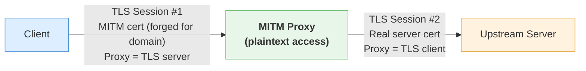
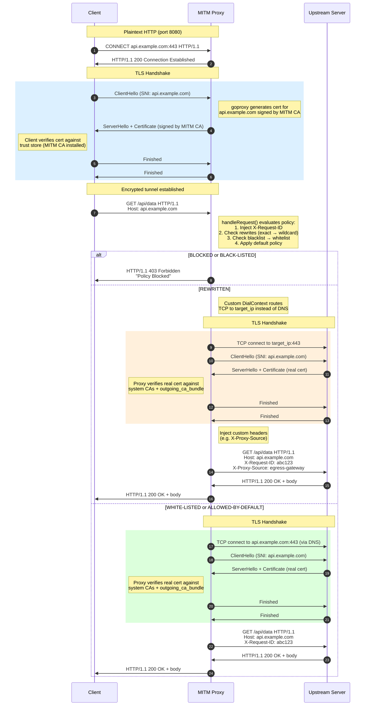
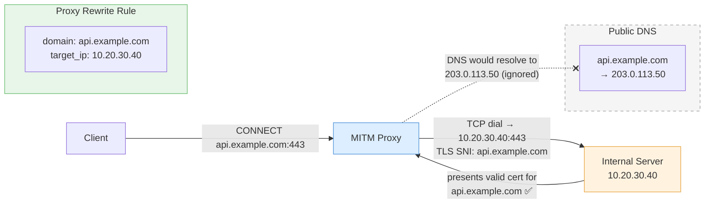
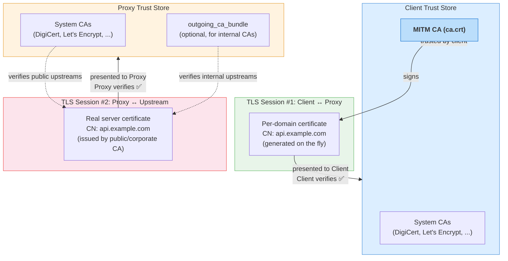

# HTTPS Proxy Flow & Certificate Architecture

This document describes the complete flow of an HTTPS request through the MITM proxy, including all certificates involved, how they are generated, and how TLS is terminated and re-established.

## Certificates Overview

There are **four** certificate/key artifacts involved in a proxied HTTPS connection:

| # | Artifact | Who holds it | Purpose |
|---|----------|-------------|---------|
| 1 | **MITM CA Certificate** (`ca.crt`) | Proxy + all clients (trust store) | Root of trust for intercepted connections |
| 2 | **MITM CA Private Key** (`ca.key`) | Proxy only | Signs per-domain certificates on the fly |
| 3 | **Per-domain certificate** | Generated in memory by proxy | Presented to the client, impersonates the real server |
| 4 | **Upstream server's real certificate** | Origin server | Verified by the proxy using system CAs (+ optional `outgoing_ca_bundle`) |

### Certificate Generation

The MITM CA is generated once and distributed ahead of time:

```bash
# scripts/gen-ca.sh
openssl genrsa -out certs/ca.key 4096
openssl req -x509 -new -nodes -key certs/ca.key -sha256 -days 3650 -out certs/ca.crt \
  -subj "/C=US/ST=State/L=City/O=ProxyCorp/OU=Security/CN=Internal-MITM-CA"
```

Alternatively, the CA can be provided as a PKCS#12 keystore (`.p12`) instead of separate PEM files.

**Deployment requirements:**
- `ca.crt` + `ca.key` (or `.p12`) must be available to the proxy at startup.
- `ca.crt` must be installed as a **Trusted Root CA** on every client machine (OS trust store, browser, container, etc.). Without this, clients will reject the proxy-generated certificates.

### Per-Domain Certificate (On-the-Fly)

When the proxy intercepts a CONNECT tunnel, `goproxy` dynamically generates a TLS certificate for the requested domain:
1. Creates a new X.509 certificate with the target hostname as Subject/SAN.
2. Signs it with the MITM CA private key.
3. This certificate lives only in memory for the duration of the connection.

## Full HTTPS Connection Flow

### Step-by-step

1. **Client initiates CONNECT** -- The client sends an HTTP `CONNECT host:443` request to the proxy over plaintext HTTP.

2. **Proxy accepts the tunnel** -- The proxy responds with `200 Connection Established`. The TCP tunnel is now open.

3. **Client-side TLS handshake (MITM)** -- The proxy acts as the TLS server. `goproxy` generates a certificate for `host` signed by the MITM CA and presents it. The client verifies it against its trust store (which includes the MITM CA) and the handshake completes.

4. **Client sends HTTP request** -- Over the now-encrypted tunnel, the client sends the actual HTTP request (e.g., `GET /api/data`).

5. **Proxy evaluates policy** -- The `handleRequest` function processes the request:
   - Generates and injects `X-Request-ID` header
   - Checks **rewrite rules** (exact match, then wildcard patterns)
   - If no rewrite matched: checks **blacklist** -> **whitelist** -> **default policy**
   - If blocked (`BLACK-LISTED` or `BLOCKED`): returns `403 Forbidden` immediately; no upstream connection is made.

6. **Proxy dials upstream** -- For allowed/rewritten requests, the custom `DialContext` resolves the destination:
   - **Normal case:** dials the original `host:443` via DNS
   - **Rewrite case (split-brain DNS):** dials `target_ip:443` instead, bypassing DNS entirely. TLS SNI still uses the original hostname, so the upstream server's certificate is verified against the original domain.

7. **Upstream TLS handshake** -- The proxy acts as a TLS client toward the origin server. It verifies the server's real certificate against:
   - System CA trust store
   - Optional `outgoing_ca_bundle` (for internal/corporate CAs)

8. **Request forwarded** -- The proxy forwards the (potentially modified) request to the upstream server. For rewritten domains, custom headers are injected.

9. **Response relayed** -- The upstream response flows back through both TLS tunnels to the client. Response metrics are recorded.

### Two Independent TLS Sessions

The proxy maintains **two separate TLS sessions** simultaneously:



The proxy has access to the plaintext HTTP request/response between these two TLS sessions, which is what enables inspection, policy enforcement, header injection, and logging.

## Sequence Diagram



## Split-Brain DNS Detail

In the rewrite case, the proxy achieves split-brain DNS **at the TCP dial layer**, not at DNS level. The upstream server at the `target_ip` must present a valid certificate for the original domain. This is the typical pattern for routing traffic to an internal load balancer or service mesh endpoint that terminates TLS for the original domain.



## Trust Chain Summary


